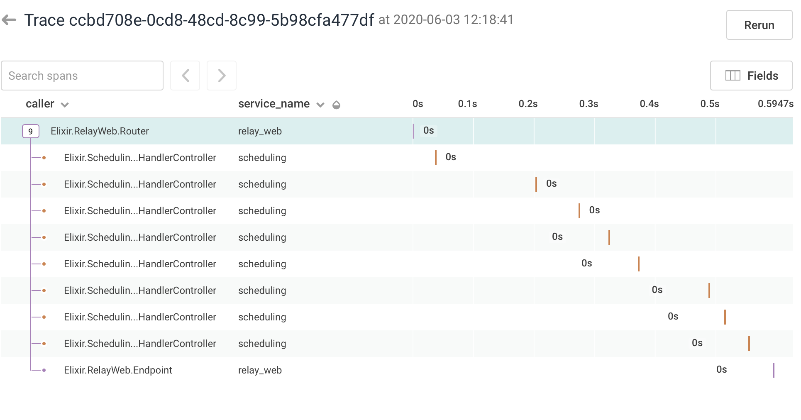

# Hummingbird

A plug to correlate events between services in two lines of Elixir.

Given appropriate trace headers, ships an event for router and response calls.

## To Use

```elixir
defmodule YourAppWeb.YourController do
  use YourAppWeb, :controller

  plug Hummingbird, service_name: "your_service_name"
end
```

and add the `Hummingbird.Telemetry` child to your supervision tree:

```elixir
defmodule YouApp.Application do
  # ..

  def start(_type, _args) do
    children = [
      Hummingbird.Telemetry,
      # ..
    ]

    Supervisor.start_link(children, strategy: :one_for_one, name: YourApp.Supervisor)
  end

  # ..
end
```

## Configuration

**Configure OpenCensus**

In your config.exs:

```elixir
# configure opencensus
config :opencensus,
  reporters: [{Opencensus.Honeycomb.Reporter, []}],
  send_interval_ms: 1000
```

**Set the dataset per environment**

In your dev, prod, exs files:

```elixir
# configure write key per dataset/environment
# we use environment variables to protect the secret. It doesn't matter how you
# set the value.  Choose your own adventure.

config :opencensus_honeycomb,
  dataset: "your_dataset_name_goes_here",
  write_key: "${HONEYCOMB_WRITE_KEY}"
```

## Assumptions

Currently, it looks for `x-b3-spanid` and `x-b3-traceid` headers on incoming request to create the trace.

## Current Example



## Thanks

Wraps around https://github.com/open-telemetry/opentelemetry-erlang
